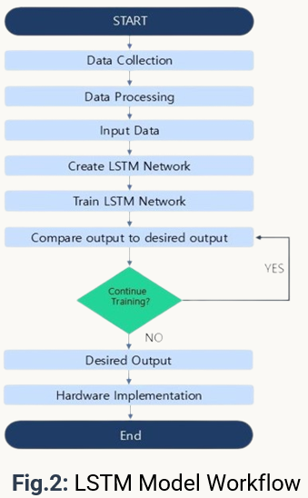
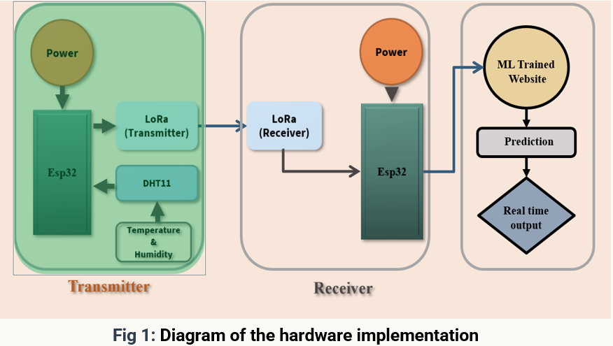
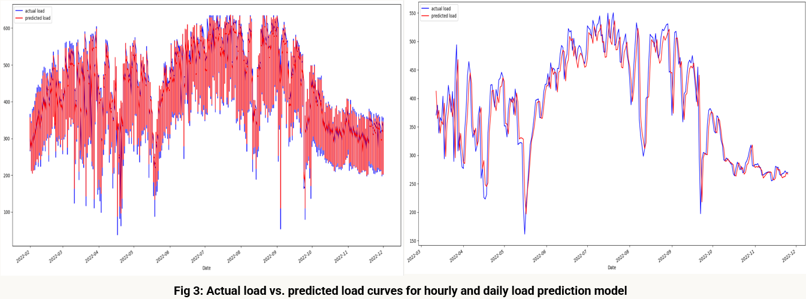

# ⚡ Website-Integrated Hardware Implementation of LSTM-Based Short-Term Load Forecasting Model  
## A Case Study for Sylhet Division, Bangladesh

<p align="center">
  
</p>

<p align="center">
  
  
  
  
</p>

---

# 📌 Overview

This project presents a **website-integrated hardware system with LSTM-based load forecasting** for the Sylhet Division power grid in Bangladesh.

It integrates:

- 📊 Deep learning (LSTM) for load forecasting  
- 🌡️ Environmental feature integration  
- 📡 IoT-based data acquisition (ESP32)  
- 🔌 LoRa communication system  
- 🌐 Web-based monitoring dashboard  

The goal is to improve **short-term electricity demand forecasting and grid stability**.

---

# 🚀 Key Features

- Hourly and daily load forecasting models
- LSTM-based time series learning
- Separate preprocessing scalers for each model
- ESP32 + sensor-based data collection system
- IoT + ML integration framework
- Web visualization support

---

# 👨‍💻 Authors

**Md. Omar Faruk Sagor¹, Saydul Islam², Md. Shahid Iqbal³, Juman Das⁴, Jahid Hasan⁵, Mrinal Sahajee⁶**

---

## 📍 Affiliations

¹,²,⁴,⁵,⁶ Department of Electrical & Electronic Engineering  
Sylhet Engineering College, Sylhet, Bangladesh  

³ Department of Electrical & Electronic Engineering  
Mymensingh Engineering College, Mymensingh, Bangladesh  

---

## 📧 Emails

¹ faruksaagoreee02@gmail.com  
² saydul@sec.ac.bd  
³ iqbal@mec.ac.bd  
⁴ jumandas278@gmail.com  
⁵ adnanjahid420@gmail.com  
⁶ mrinal098sh@gmail.com  

---

## ⭐ Contribution Note

**Machine Learning / Deep Learning Contributor:**  
👉 Juman Das (Author 4)

- Developed LSTM-based forecasting models  
- Built training and evaluation pipeline  
- Handled preprocessing and scaling workflow  
- Supported IoT + ML integration  

---

# 📂 Project Structure

```text
LFSC/
│
├── Dataset/
│   ├── 1_hour_data/
│   ├── daily_data/
│
├── figures/
│   ├── Data_pre_processing.png
│   ├── Hardware.png
│   ├── model_workflow.png
│   └── result.png
│
├── models/
│   ├── lstm_model_hourly.h5
│   ├── lstm_model_daily.h5
│   ├── scaler_hourly.pkl
│   └── scaler_daily.pkl
│
├── LSTM model/
│   ├── 1 hour lstm model.ipynb
│   ├── 1 day lstm model.ipynb
│
├── requirements.txt
└── README.md
```

---

# 🔧 Installation & Setup

## Prerequisites

- Python 3.8+
- Arduino IDE
- CUDA-compatible GPU (recommended)

---

## 1. Clone Repository

```bash
git clone https://github.com/Juman-7/Load-forecasting-for-Sylhet-Division.git
cd Load-forecasting-for-Sylhet-Division/LFSC
```

---

## 2. Create Virtual Environment

```bash
python -m venv venv
venv\Scripts\activate   # Windows
source venv/bin/activate  # Linux/macOS
```

---

## 3. Install Dependencies

```bash
pip install -r requirements.txt
```

---

# 🔌 Hardware Setup

## Components

- ESP32 Development Board  
- DHT11 Sensor  
- LoRa SX1278 Module  
- Jumper wires + breadboard  
- 5V Power supply  

---

## Hardware Diagram

<p align="center">
  
</p>

---

## Flash Firmware

1. Open Arduino IDE  
2. Load ESP32 code  
3. Select board: ESP32 Dev Module  
4. Upload firmware  

---

# 🧠 Model Information

## 📈 Hourly Model
- File: `models/lstm_model_hourly.h5`
- Scaler: `models/scaler_hourly.pkl`

## 📉 Daily Model
- File: `models/lstm_model_daily.h5`
- Scaler: `models/scaler_daily.pkl`

---

# 📊 Dataset Information

## Historical Load Data
- Source: Bangladesh Power Development Board (BPDB)
- Duration: 2018–2023
- Resolution: Hourly
- Region: Sylhet Division

## Environmental Data
- Source: NASA POWER Project
- Features: Temperature, humidity, solar radiation

---

# 📈 Results

<p align="center">
  
</p>

## Performance

| Model | MAE | MAPE |
|------|-----|------|
| Hourly LSTM | 18.47 | 5.35% |
| Daily LSTM | 27.48 | 7.78% |

---

# 🔬 Key Findings

- LSTM captures temporal load patterns effectively  
- Environmental factors improve prediction accuracy  
- Dual scaler improves stability  
- IoT system enables real-time data collection  

---

# 🧩 Dependencies

| Package | Version |
|---------|--------|
| Python | 3.8+ |
| TensorFlow | 2.x |
| NumPy | Latest |
| Pandas | Latest |
| Scikit-learn | Latest |

---

# 🔁 Reproducibility

```python
import tensorflow as tf
import numpy as np
import random

tf.random.set_seed(42)
np.random.seed(42)
random.seed(42)
```

---

# 🎓 Citation

```bibtex
@inproceedings{qpain2026lstm,
  title={Website-Integrated Hardware Implementation of LSTM-Based Short-Term Load Forecasting Model: A Case Study for Sylhet Division},
  author={Sagor, Md. Omar Faruk and Islam, Saydul and Iqbal, Md. Shahid and Das, Juman and Hasan, Jahid and Sahajee, Mrinal},
  booktitle={Proceedings of the 2nd IEEE International Conference on Quantum Photonics, Artificial Intelligence, and Networking (QPAIN)},
  year={2026},
  note={Presented at QPAIN 2026 (to be published in IEEE Xplore)},
  address={Chattogram, Bangladesh}
}
```

---

# 🤝 Contributing

1. Fork repo  
2. Create branch  
3. Commit changes  
4. Push branch  
5. Open Pull Request  

---

# 🛣️ Roadmap

- Multi-region forecasting  
- Mobile app integration  
- SCADA integration  
- Edge AI deployment  
- Real-time alert system  

---

# 📄 License

MIT License

---

# ⭐ Support

If you like this project, please give it a ⭐ on GitHub.
